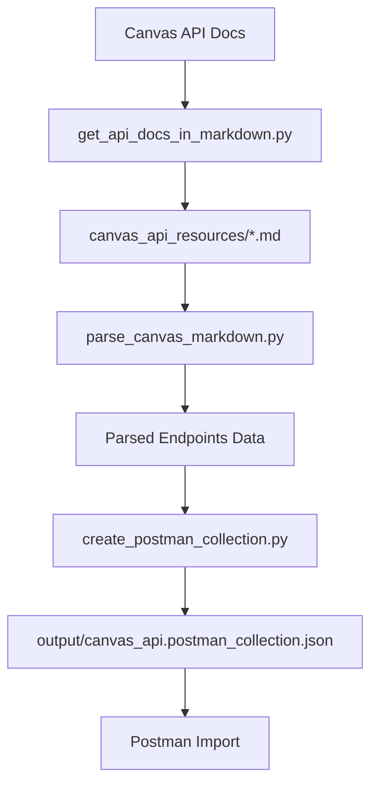

# Development Guide

This guide covers development workflow, testing, and contributing to the Canvas API Postman Collection Generator.

## Development Setup

### Prerequisites
- Python ≥3.13 (recommended) or ≥3.10 (minimum)
- uv (recommended) or pip
- Git

### Setup Development Environment

```bash
# Clone the repository
git clone <repository-url>
cd canvas-api-postman-master

# Create virtual environment and install with dev dependencies
uv venv
uv pip install -e ".[dev]"

# Activate virtual environment (if needed)
source .venv/bin/activate
```

## Project Structure

```
├── create_postman_collection.py    # Main collection generator
├── parse_canvas_markdown.py        # Markdown parser
├── get_api_docs_in_markdown.py     # API docs fetcher
├── test_collection.py              # Collection validation
├── canvas_api_resources/           # Canvas API markdown docs
├── output/                         # Generated collections
├── docs/                          # Documentation
├── pyproject.toml                 # Project configuration
├── justfile                       # Task automation
└── uv.lock                        # Dependency lock
```

## Available Commands

The project uses `just` for task automation:

```bash
# Core functionality
just fetch-docs     # Download latest Canvas API docs
just collection     # Generate Postman collection
just test          # Validate generated collection

# Documentation
just docs-serve    # Serve documentation locally
just format-docs   # Format markdown files with prettier

# Development
just clean         # Clean generated files
just lint          # Run linting (if configured)
```

## Development Workflow

### 1. Making Changes

```bash
# Create a feature branch
git checkout -b feature/your-feature-name

# Make your changes
# ... edit files ...

# Test your changes
just test
python create_postman_collection.py

# Validate the generated collection
python test_collection.py
```

### 2. Testing

#### Manual Testing
```bash
# Generate collection and check output
python create_postman_collection.py
ls -la output/

# Validate collection structure
python test_collection.py

# Test specific parsing
python parse_canvas_markdown.py
```

#### Collection Validation
The `test_collection.py` script validates:
- JSON structure integrity
- Required fields presence
- Authentication configuration
- Variable definitions
- Request format compliance

### 3. Documentation

#### Local Documentation Server
```bash
# Serve docs locally (auto-reload on changes)
just docs-serve

# Open http://localhost:8000 in browser
```

#### Documentation Structure
- `docs/index.md` - Project overview
- `docs/installation.md` - Setup instructions
- `docs/usage.md` - Usage guide
- `docs/development.md` - This file
- `docs/cli_reference.md` - Command reference

## Code Architecture

### Core Components

#### `parse_canvas_markdown.py`
- **Purpose**: Parse Canvas API markdown files
- **Key Functions**:
  - `parse_markdown_file()` - Parse individual markdown files
  - `extract_endpoints()` - Extract API endpoints using regex
  - `parse_parameter_table()` - Parse parameter tables
  - `extract_oauth_scopes()` - Extract OAuth scope information

#### `create_postman_collection.py`
- **Purpose**: Generate Postman collection JSON
- **Key Functions**:
  - `create_collection()` - Main collection creation
  - `create_folder()` - Create resource folders
  - `create_request()` - Create individual requests
  - `setup_auth()` - Configure authentication

#### `get_api_docs_in_markdown.py`
- **Purpose**: Fetch latest Canvas API documentation
- **Key Functions**:
  - `fetch_api_docs()` - Download documentation
  - `parse_resource_links()` - Extract resource URLs
  - `save_markdown()` - Save documentation files

### Data Flow



## Adding New Features

### Adding New Endpoint Patterns

If Canvas introduces new endpoint patterns:

1. **Update Regex Patterns** in `parse_canvas_markdown.py`:
   ```python
   ENDPOINT_PATTERN = re.compile(
       r'\*\*`(GET|POST|PUT|DELETE|PATCH)\s+([^`]+)`\*\*',
       re.MULTILINE
   )
   ```

2. **Test Pattern Matching**:
   ```bash
   python parse_canvas_markdown.py
   # Check output for new endpoints
   ```

### Adding New Parameter Types

To support new parameter types:

1. **Update Parameter Parsing** in `parse_canvas_markdown.py`
2. **Update Request Generation** in `create_postman_collection.py`
3. **Add Tests** in `test_collection.py`

### Adding New Authentication Methods

To support additional auth methods:

1. **Update Auth Configuration** in `create_postman_collection.py`
2. **Update Collection Template**
3. **Document in Usage Guide**

## Testing Guidelines

### Manual Testing Checklist

- [ ] Collection generates without errors
- [ ] All expected endpoints are present
- [ ] Authentication is properly configured
- [ ] Path variables are correctly formatted
- [ ] Query parameters are included
- [ ] Request bodies are properly structured
- [ ] Collection imports successfully into Postman

### Automated Testing

Currently, the project uses manual testing. To add automated testing:

```bash
# Install pytest
uv pip install pytest

# Create tests directory
mkdir tests/
touch tests/__init__.py
touch tests/test_parser.py
touch tests/test_collection.py
```

## Contributing

### Code Style

- Follow PEP 8 Python style guidelines
- Use type hints where appropriate
- Keep functions focused and well-documented
- Use meaningful variable names

### Commit Guidelines

- Use clear, descriptive commit messages
- Keep commits focused on single changes
- Reference issues when applicable

### Pull Request Process

1. Fork the repository
2. Create a feature branch
3. Make your changes
4. Test thoroughly
5. Update documentation if needed
6. Submit pull request with clear description

## Debugging

### Common Issues

#### Parsing Errors
```bash
# Debug markdown parsing
python parse_canvas_markdown.py > debug_output.txt
# Check debug_output.txt for parsing issues
```

#### Collection Generation Errors
```bash
# Run with verbose output
python -v create_postman_collection.py
```

#### Missing Endpoints
1. Check if markdown files are up to date: `just fetch-docs`
2. Verify regex patterns in `parse_canvas_markdown.py`
3. Check for new endpoint formats in Canvas docs

### Logging

Add logging for debugging:

```python
import logging
logging.basicConfig(level=logging.DEBUG)
logger = logging.getLogger(__name__)

# Use throughout code
logger.debug("Parsing file: %s", filename)
logger.info("Found %d endpoints", len(endpoints))
```

## Performance Considerations

- **File I/O**: Minimize file operations
- **Memory Usage**: Process files incrementally for large datasets
- **Regex Performance**: Compile patterns once, reuse
- **JSON Generation**: Use efficient JSON libraries

## Future Enhancements

Potential areas for improvement:

- **Automated Testing**: Add pytest-based test suite
- **CI/CD Pipeline**: Automated testing and collection generation
- **OpenAPI Support**: Generate OpenAPI specs alongside Postman
- **Interactive CLI**: Add command-line interface with options
- **Collection Validation**: More comprehensive validation rules
- **Performance Optimization**: Parallel processing for large doc sets
