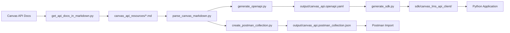

# Canvas API Postman Collection & Python SDK Generator

## Overview

This project generates comprehensive **Postman collections** and **modern Python SDKs** directly from the official Canvas LMS API documentation. Instead of manually creating API requests or SDK code, this tool automatically parses Canvas API markdown documentation and creates production-ready tools with over 1,000 endpoints.

## Key Features

### Postman Collection Generation

- **🚀 Comprehensive Coverage**: 1,018+ endpoints across 128 Canvas API resource types
- **📚 Always Up-to-Date**: Generated from official Canvas API markdown documentation
- **🔐 Authentication Ready**: Pre-configured OAuth2 Bearer token authentication
- **📝 Well Documented**: Each request includes parameter descriptions and OAuth scopes
- **🎯 Organized Structure**: Requests grouped by resource type (Courses, Users, Assignments, etc.)
- **⚡ Dynamic Variables**: Path variables like `:course_id` and `:user_id` for easy testing

### Python SDK Generation

- **🐍 Modern Python SDK**: Full type hints with IDE autocomplete support
- **⚡ Async/Sync Support**: Use `asyncio()` or `sync()` methods as needed
- **🔒 Built-in Authentication**: Bearer token authentication pre-configured
- **📊 Pydantic Models**: 234+ data schemas with automatic validation
- **🎯 Type Safety**: Catch errors at development time, not runtime
- **🚀 Python 3.13+ Ready**: Uses latest language features

### OpenAPI Specification

- **📋 OpenAPI 3.1 Compliant**: Industry-standard API specification
- **🔍 JSON Schema Validation**: Complete request/response validation
- **📖 Rich Documentation**: Parameter descriptions extracted from markdown
- **🔐 Security Schemes**: OAuth2 properly defined and documented

## Architecture

The project consists of several key components:

### Core Scripts

- **`create_postman_collection.py`** - Main collection generator
- **`parse_canvas_markdown.py`** - Enhanced markdown parser with schema extraction
- **`get_api_docs_in_markdown.py`** - Canvas API documentation fetcher
- **`generate_openapi.py`** - OpenAPI 3.1 specification generator
- **`generate_sdk.py`** - Python SDK generator using openapi-python-client
- **`canvas_openapi/`** - OpenAPI generation modules
- **`test_collection.py`** - Collection validation and testing

### Data Flow



### Dependencies

- **Python ≥3.13** with modern async/await support
- **uv** for fast dependency management
- **requests** and **beautifulsoup4** for web scraping
- **markdown** and **python-frontmatter** for parsing
- **genson** for JSON schema generation from examples
- **openapi-schema-pydantic** for OpenAPI validation
- **openapi-python-client** for SDK generation
- **mkdocs-material** for documentation (dev dependency)

## Project Structure

```
├── create_postman_collection.py    # Main collection generator
├── parse_canvas_markdown.py        # Enhanced markdown parser with schema extraction
├── get_api_docs_in_markdown.py     # API documentation fetcher
├── generate_openapi.py             # OpenAPI 3.1 specification generator
├── generate_sdk.py                 # Python SDK generator
├── canvas_openapi/                 # OpenAPI generation modules
│   ├── builder.py                  # OpenAPI spec builder
│   └── generator.py                # CLI interface
├── test_collection.py              # Collection validation
├── canvas_api_resources/           # Downloaded Canvas API docs (128+ files)
├── output/                         # Generated files
│   ├── canvas_api.postman_collection.json  # Postman collection
│   ├── canvas_api.openapi.yaml     # OpenAPI specification
│   └── canvas_api.openapi.json     # OpenAPI specification (JSON)
├── sdk/                           # Generated Python SDK
│   ├── canvas_lms_api_client/     # Main SDK package
│   ├── pyproject.toml             # SDK project configuration
│   └── README.md                  # SDK documentation
├── docs/                          # Project documentation
├── pyproject.toml                 # Python project configuration
├── justfile                       # Task automation
└── uv.lock                        # Dependency lock file
```

## Quick Start

1. **Install Dependencies**

   ```bash
   uv venv && uv pip install -e .
   ```

2. **Generate Everything**

   ```bash
   just generate-all  # Generates Postman collection, OpenAPI spec, and Python SDK
   ```

3. **Use the Generated Tools**

   **Postman Collection:**
   - Import `output/canvas_api.postman_collection.json`
   - Set `base_url` and `canvas_token` environment variables

   **Python SDK:**

   ```python
   from canvas_lms_api_client import AuthenticatedClient
   from canvas_lms_api_client.api.courses import get_courses

   client = AuthenticatedClient(
       base_url="https://yourschool.instructure.com/api/v1",
       token="your-access-token"
   )

   # Get all courses
   courses = get_courses.sync(client=client)
   ```

   **OpenAPI Specification:**
   - Use `output/canvas_api.openapi.yaml` with any OpenAPI-compatible tool
   - Generate clients in other languages using OpenAPI generators

## Next Steps

- [Installation Guide](installation.md) - Detailed setup instructions
- [Usage Guide](usage.md) - Complete usage documentation for all tools
- [Python SDK](python_sdk.md) - Comprehensive Python SDK documentation
- [OpenAPI Specification](openapi.md) - OpenAPI generation and usage guide
- [Development](development.md) - Contributing and development workflow
- [CLI Reference](cli_reference.md) - Command-line interface documentation
