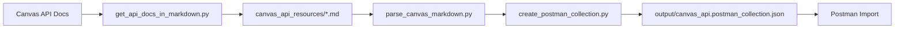

# Canvas API Postman Collection Generator

## Overview

This project generates comprehensive Postman collections directly from the official Canvas LMS API documentation. Instead of manually creating API requests, this tool automatically parses Canvas API markdown documentation and creates a fully-featured Postman collection with over 1,000 endpoints.

## Key Features

- **🚀 Comprehensive Coverage**: 1,018+ endpoints across 128 Canvas API resource types
- **📚 Always Up-to-Date**: Generated from official Canvas API markdown documentation
- **🔐 Authentication Ready**: Pre-configured OAuth2 Bearer token authentication
- **📝 Well Documented**: Each request includes parameter descriptions and OAuth scopes
- **🎯 Organized Structure**: Requests grouped by resource type (Courses, Users, Assignments, etc.)
- **⚡ Dynamic Variables**: Path variables like `:course_id` and `:user_id` for easy testing

## Architecture

The project consists of several key components:

### Core Scripts

- **`create_postman_collection.py`** - Main collection generator
- **`parse_canvas_markdown.py`** - Markdown documentation parser
- **`get_api_docs_in_markdown.py`** - Canvas API documentation fetcher
- **`test_collection.py`** - Collection validation and testing

### Data Flow



### Dependencies

- **Python ≥3.13** with modern async/await support
- **uv** for fast dependency management
- **requests** and **beautifulsoup4** for web scraping
- **markdown** and **python-frontmatter** for parsing
- **mkdocs-material** for documentation (dev dependency)

## Project Structure

```
├── create_postman_collection.py    # Main collection generator
├── parse_canvas_markdown.py        # Markdown parser with regex extraction
├── get_api_docs_in_markdown.py     # API documentation fetcher
├── test_collection.py              # Collection validation
├── canvas_api_resources/           # Downloaded Canvas API docs (128+ files)
├── output/                         # Generated Postman collections
├── docs/                          # Project documentation
├── pyproject.toml                 # Python project configuration
├── justfile                       # Task automation
└── uv.lock                        # Dependency lock file
```

## Quick Start

1. **Install Dependencies**
   ```bash
   uv venv && uv pip install -e .
   ```

2. **Generate Collection**
   ```bash
   just collection
   ```

3. **Import to Postman**
   - Import `output/canvas_api.postman_collection.json`
   - Set `base_url` and `canvas_token` environment variables

## Next Steps

- [Installation Guide](installation.md) - Detailed setup instructions
- [Usage Guide](usage.md) - Complete usage documentation
- [Development](development.md) - Contributing and development workflow
- [CLI Reference](cli_reference.md) - Command-line interface documentation
